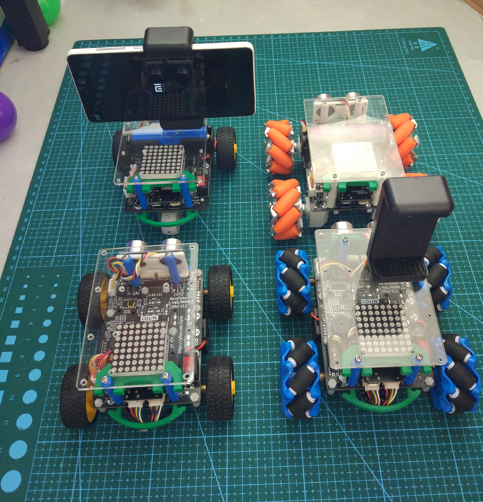

# 2WD-4WD-MKNM智能小车

### 一、介绍
2WD-4WD-MKNM智能小车
MicroPython控制程序及使用说明

### 二、功能特点
#### 2.1  板载4路编码器直流电机控制接口。使用高精度编码器空心杯电机，内置AB相霍尔编码器。对应电机输出轴每相每转450线，使用52mm车轮时编码器测距分辨率约为0.36mm。

#### 2.2  板载单芯锂电池充电管理芯片，最大充电电流500mA。编程和充电共用同一个microUSB接口。整机充电时间约为3小时，使用时间2－5小时。
  
#### 2.3  ESP32 MicroPython编程。开发便捷，易于扩展。  人生苦短，请用Python ! 

#### 2.4  小车可通过Android手机遥控，也可使用PC机通过Wifi UDP编程控制。
#### 2.5  提供HCSR04超声测距传感器软硬件接口。
#### 2.6  提供Max7219类控制芯片8x8LED点阵显示模块软硬件接口。
#### 2.7  板载红外遥控接收头，可使用普通红外遥控器控制小车。
#### 2.8  板载无源蜂鸣器，可播放单频音乐。
#### 2.9  单层小车外形尺寸如下：
    配52mm麦克纳姆轮：125x130x65 mm
    配68mm普通橡胶轮：135x140x70 mm

### 四、基础编程实验
#### 4.1 MicroPython编程及Thonny IDE使用入门
#### 4.2 GPIO输入输出及UartPrintf显示数据曲线
#### 4.3 ADC数据读取－电池电压测量/USB输入电压判别
#### 4.4 PWM无源蜂鸣器音乐播放及有刷直流电机速度开环控制
#### 4.5  AB相编码器电机转速测量
#### 4.6  有刷直流电机速度/位置PID闭环控制
#### 4.7  红外遥控原理及功能演示
#### 4.8  Hcsr04超声测距模块使用
#### 4.9  Max7219  8*8LED点阵显示
#### 4.10  超声跟随Demo
#### 4.11  手动示教Demo
#### 4.12  Android App使用Wifi UDP遥控

### 五、进阶实险
#### 5.1  Android手机Aidlux Python OpenCV使用入门
#### 5.2  OpenCV/OpenMV 物体检测及寻迹追踪
#### 5.3  命令词语音识别及简单对话

提供详细的使用说明书，概览图如下。详情查阅请下载说明书PDF文件。

